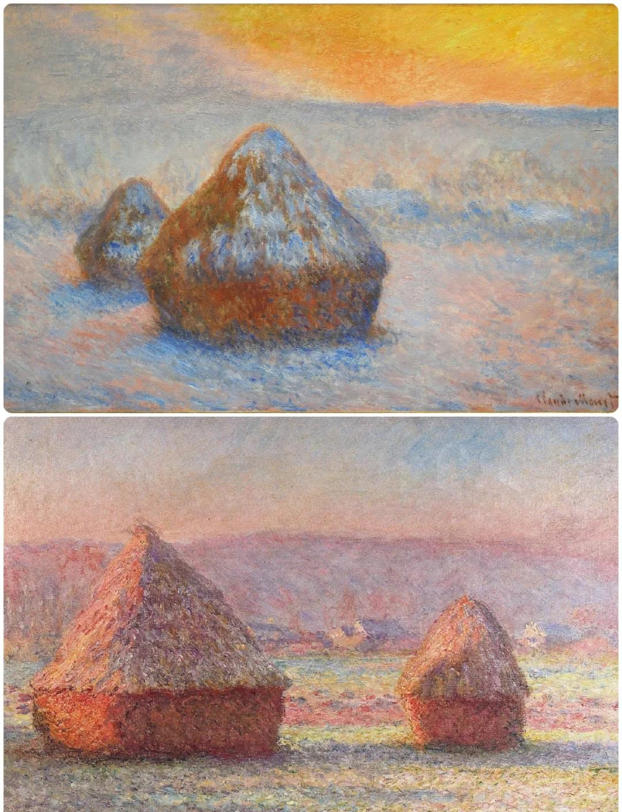
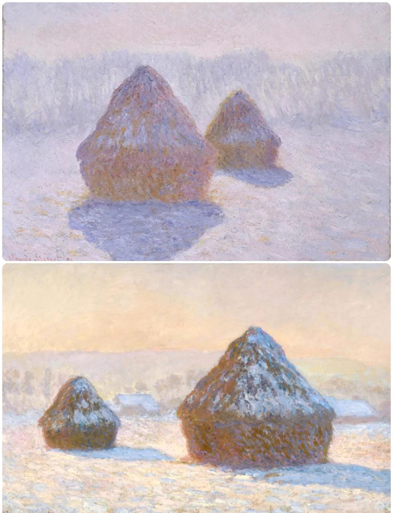
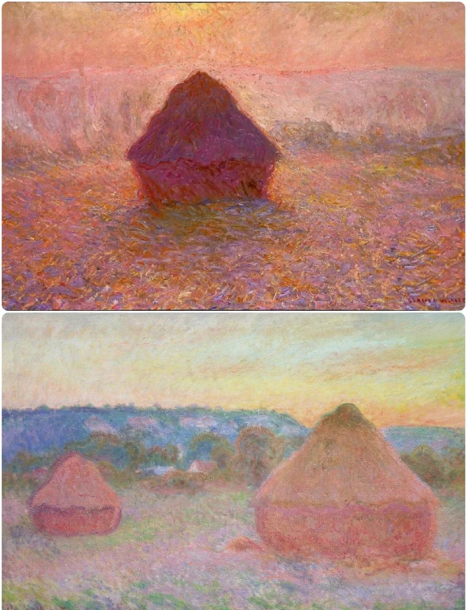
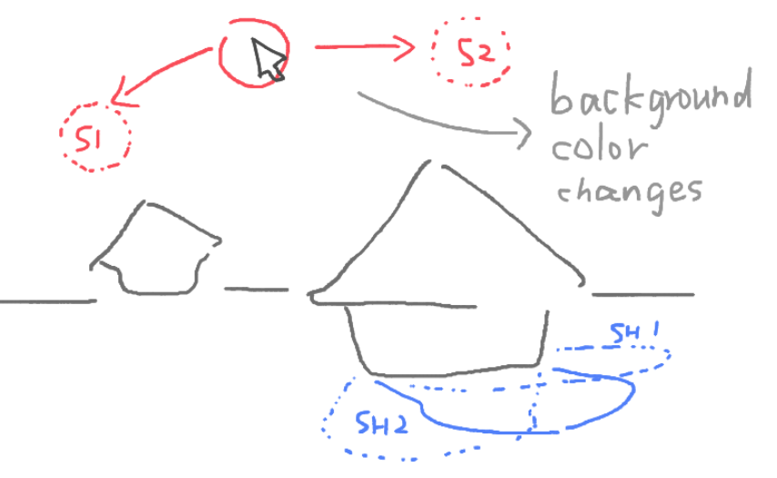

# Quiz 8

## Imaging Technique Inspiration

I am inspired by **Monet’s Haystacks** series, where layered warm and cool colours are used to show how the same haystack changes appearance at different times of day. 

I want to explore the relationship between light, colour, atmosphere, and time through creative coding. Instead of creating a realistic painting, I plan to organise the image using arrays of simple geometric shapes and layered colours. 

The mouse position will control the location of the sun, causing the haystack’s shadow, colours, and background atmosphere to gradually change in response to the light position.

## Coding Technique Exploration

I researched coding references for interactive lighting, colour changes, and mosaic-based image construction. 

- **Interactive lighting and shadows:** 

[Sight & Light - 2D visibility and shadow effects](https://ncase.me/sight-and-light/)

The *Sight & Light* tutorial demonstrates how a mouse-controlled light source can create 2D visibility and shadow effects by casting rays and calculating intersections with object edges. This helps me understand how shadows can respond to the position of a light source.

- **Sun position and colour changes:**

[An Interactive Sun - Conditionals and Interactivity](https://p5js.org/tutorials/conditionals-and-interactivity/)

I also looked at examples where the mouse position controls the sun and changes the background colour. This supports the atmosphere shift in my idea.

- **Mosaic-based image construction:** 

[Convert images to mosaics in p5.js](https://dev.to/andyhaskell/convert-images-to-mosaics-in-p5js-2dlc)

A mosaic filter can help me construct the haystack through simple geometric blocks instead of realistic details.

